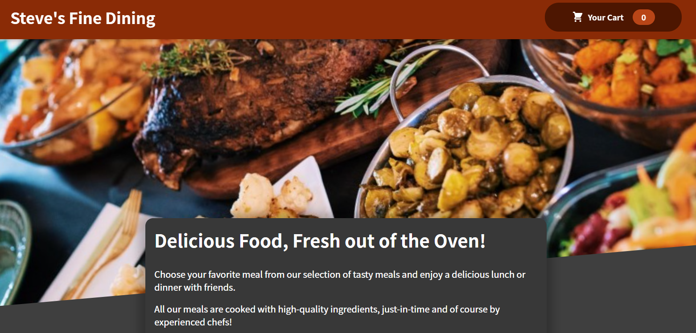

## Welcome to Steve's Fine Dining!

# Screenshot of App

## DESCRIPTION

This is a simple food ordering app with a shopping cart!

This app can be viewed at: https://sjlevalley.github.io/StevesFineDining/.

## TABLE OF CONTENTS

- [Description](#description)
- [Installation](#Installation)
- [Usage](#Usage)
- [Credits](#Credits)
- [Questions](#Questions)

## INSTALLATION

To install the dependencies necessary for this project, run the following command:

- npm i

## USAGE

- This project requires Requires node v14+ to run.

## CREDITS

- This project was inspired from a React/Redux Course from Udemy by the people at Academind

## QUESTIONS

- If you have any questions, I can be reached through me email at slevalley@gmail.com. My GitHub profile can be viewed at at
  [sjlevalley](https://www.github.com/sjlevalley).
